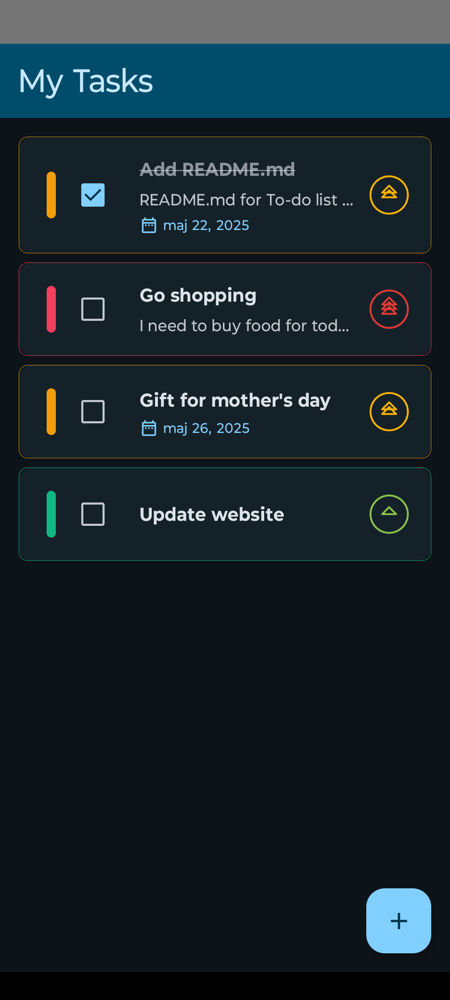
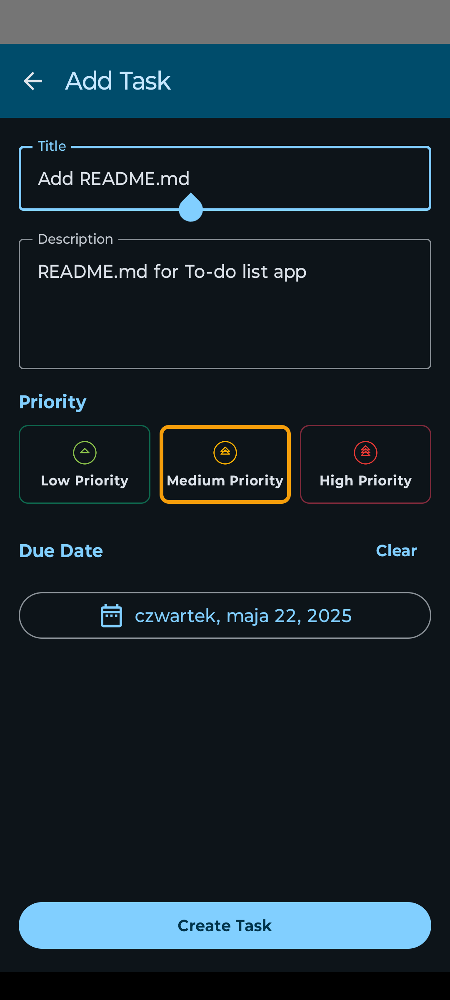
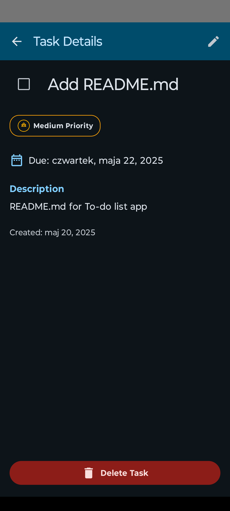
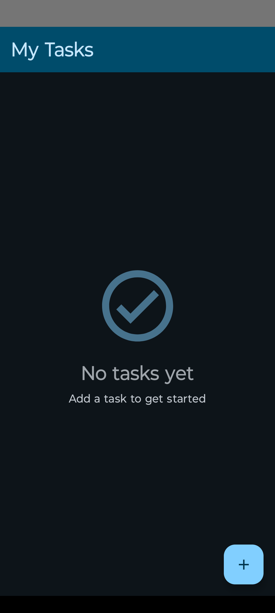

# To-Do List Application

A modern and feature-rich To-Do List application built with **Kotlin** and **Jetpack Compose**. This app allows users to manage their tasks efficiently with features like task creation, editing, deletion, and completion tracking. The app is designed with a clean architecture and leverages **Koin** for dependency injection and **Room** for local data persistence.

## Features

- **Task Management**: Create, edit, delete, and mark tasks as completed.
- **Priority Levels**: Assign priority levels (High, Medium, Low) to tasks.
- **Due Dates**: Add due dates to tasks for better organization.
- **Task Details**: View detailed information about each task.
- **Offline Support**: All data is stored locally using Room Database.
- **Modern UI**: Built with Jetpack Compose for a responsive and intuitive user interface.
- **State Management**: Uses Kotlin `StateFlow` for reactive UI updates.

## Screenshots
 

## Architecture

The app follows **MVVM (Model-View-ViewModel)** architecture with a clean separation of concerns:

1. **UI Layer**: Built with Jetpack Compose for declarative UI.
2. **ViewModel Layer**: Handles business logic and state management using `StateFlow`.
3. **Data Layer**: Manages local data storage with Room and provides a repository for data access.

## Tech Stack

- **Kotlin**: Programming language.
- **Jetpack Compose**: Modern UI toolkit for building native Android UIs.
- **Room**: Local database for offline data persistence.
- **Koin**: Dependency injection framework.
- **Coroutines**: For asynchronous programming.
- **Navigation Component**: For managing app navigation.
- **Material Design 3**: For a modern and consistent UI.

## Project Structure
